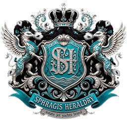
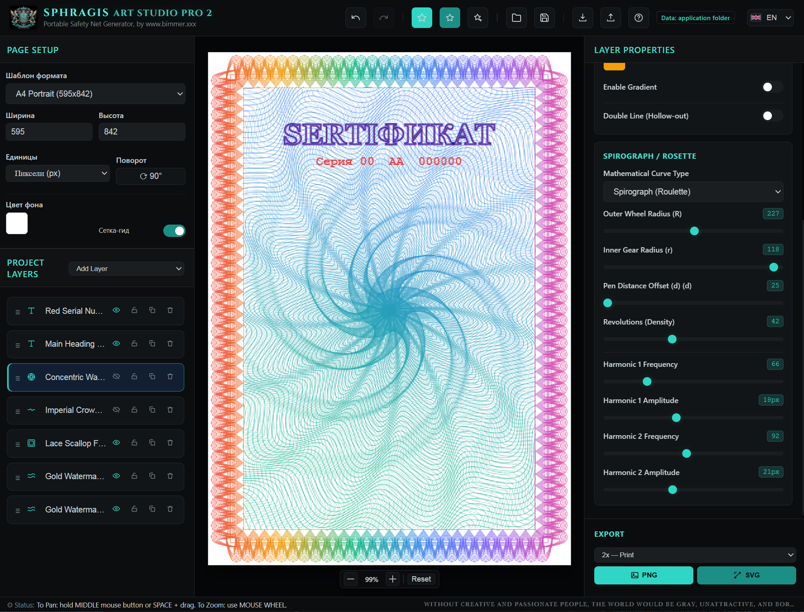
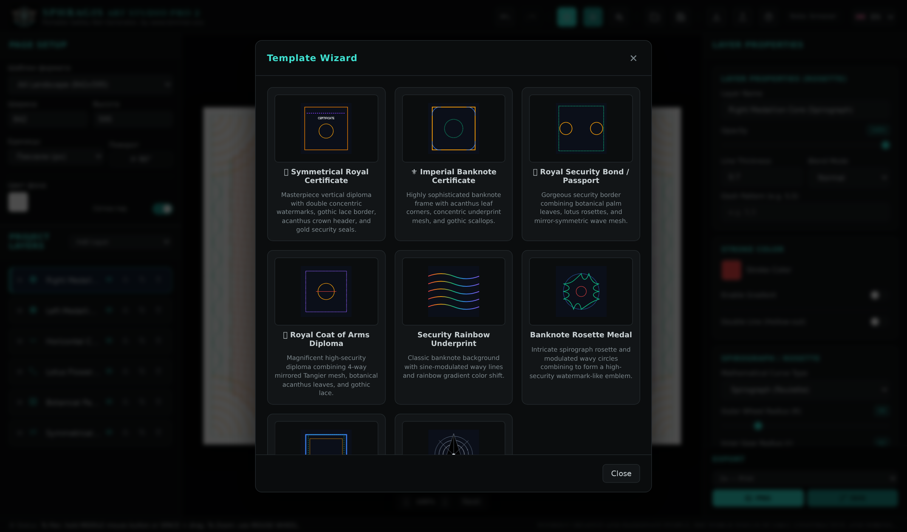

  

<h1 align="center">SPHRAGIS ART STUDIO PRO 2</h1>

<b>All-In-One Security Graphics Designer</b> 
Guilloche &middot; Rosettes &middot; Security grids &middot; Borders &middot; Vignettes &middot; Engraving

  
  
  
  

<i>Portable, offline-first successor of the classic security-print tools — CERBER, GLISSANDO PRO and GRAVER / StrokesMaker.</i>

---

## Screenshots

  

  

## What is this?

A professional tool for designing **security graphics**: banknote-style guilloche rosettes, protective underprint grids, ornamental borders, vignettes, mosaic patterns and photo-to-engraving conversion — the kind of artwork used on certificates, diplomas, bonds, passports and security documents.

Everything runs **fully offline**. The whole application is a single self-contained HTML file: open it in any modern browser and work. No installation, no internet, no telemetry.

## Key features

- **8 layer types** — rosette, guilloche grid, border, vignette, graver (photo engraving), mosaic, text and graphic layers. Every layer has its own **opacity and 16 blend modes** (Multiply, Screen, Overlay, Color Burn, Hue, Luminosity and more).
- **8 built-in design presets** — Symmetrical Royal Certificate, Imperial Banknote, Royal Security Bond / Passport, Royal Coat of Arms Diploma, Security Rainbow Underprint, Banknote Rosette Medal, Classic Certificate Border, Guilloche Mosaic Rosette.
- **True vector SVG export** with embedded fonts — clean output for Adobe Illustrator, CorelDRAW, Inkscape or laser engravers.
- **PNG export up to 8x (600 DPI)** for print-quality rasters.
- **JSON projects** — save, share and re-import your designs.
- **Smart font engine** — reads real font names from TTF/OTF files, detects Latin / Cyrillic / digits coverage, marks fonts as `no Cyrillic`, `no Latin`.
- **English / Russian interface** — switch anytime from the header.
- **Comfortable canvas** — pan with `Space`+drag, middle mouse or `Shift`+drag, undo/redo with `Ctrl+Z` / `Ctrl+Y`.
- **Protected code** — the JavaScript core is encrypted; the shipped HTML contains no readable source.

## Download

Grab a package from the [**Releases**](../../releases) page:

| Package | What inside | For whom |
|---|---|---|
| **Standalone** | Own Chromium engine bundled into the EXE. No Microsoft components needed. Larger build. | Guaranteed run on any Windows 10/11, zero dependencies |
| **Lite** | Small portable EXE using the system WebView2 engine (usually preinstalled on Windows 10/11; a fixed-runtime embedding guide is included). | Small download, normal Windows with WebView2 |

Both packages work identically and both also contain the single-file HTML version you can simply open in a browser — including macOS and Linux.

## Quick start

**Option A — browser (any OS).**
Unzip, double-click `Art_Studio_Pro1_Standalone.html`. That's it.

**Option B — Windows desktop EXE.**
1. Unzip the package on Windows 10/11.
2. Double-click `BUILD.bat` — it finds or auto-installs Python, then builds the application.
3. The ready-to-use app appears in `dist\ArtStudioPro\`.

Exports (`.svg`, `.png`, `.json`) are written into the `exports\` folder next to the app.

## License

Proprietary — all rights reserved. See [LICENSE](LICENSE). The application code is encrypted and licensed for use; copying, modification, extraction of the source code and reverse engineering are not permitted.

© 2026 SPHRAGIS &middot; www.bimmer.xxx

---

# По-русски

<h1 align="center">SPHRAGIS ART STUDIO PRO 2</h1>

<b>Всё-в-одном конструктор защитной графики</b> 
Гильош &middot; Розетки &middot; Защитные сетки &middot; Бордюры &middot; Виньетки &middot; Гравюра

<i>Портативный потомок классических программ защищённой полиграфии — CERBER, GLISSANDO PRO и GRAVER / StrokesMaker.</i>

## Что это?

Профессиональный инструмент для проектирования **защитной графики**: банкнотные гильоширные розетки, защитные фоновые сетки, орнаментальные бордюры, виньетки, мозаичные узоры и перевод фотографий в гравюру — та графика, что используется на сертификатах, дипломах, облигациях, паспортах и охранных документах.

Всё работает **полностью офлайн**. Приложение — один самодостаточный HTML-файл: откройте его в любом современном браузере и работайте. Без установки, без интернета, без телеметрии.

## Возможности

- **8 типов слоёв** — розетка, гильоширная сетка, бордюр, виньетка, гравюра (перевод фото в штрихи), мозаика, текст и графика. У каждого слоя — своя **непрозрачность и 16 режимов наложения** (Multiply, Screen, Overlay, Color Burn, Hue, Luminosity и другие).
- **8 встроенных пресетов** — Королевский сертификат, Императорский билет, Королевская облигация / Паспорт, Гербовый диплом, Радужная защитная сетка, Банкнотная медаль-розетка, Классический бордюр, Мозаичная розетка.
- **Экспорт в векторный SVG** со встроенными шрифтами — чистый результат для Adobe Illustrator, CorelDRAW, Inkscape или лазерных граверов.
- **Экспорт PNG до 8x (600 DPI)** — печатное качество.
- **JSON-проекты** — сохраняйте, передавайте, импортируйте обратно.
- **Умная система шрифтов** — читает настоящие имена из TTF/OTF, определяет покрытие (латиница / кириллица / цифры), помечает `no Cyrillic`, `no Latin`.
- **Интерфейс English / Русский** — переключение в шапке в любой момент.
- **Удобный холст** — панорама через `Space`+мышь, среднюю кнопку или `Shift`+мышь, отмена/повтор `Ctrl+Z` / `Ctrl+Y`.
- **Защищённый код** — ядро JavaScript зашифровано, в распространяемом файле нет читаемого исходника.

## Скачать

Пакеты лежат на странице [**Releases**](../../releases):

| Пакет | Что внутри | Для кого |
|---|---|---|
| **Standalone** | Собственный движок Chromium, вшитый в EXE. Ничего от Microsoft не нужно. Крупнее. | Гарантированный запуск на любой Windows 10/11, ноль зависимостей |
| **Lite** | Компактный портативный EXE на системном движке WebView2 (обычно уже есть в Windows 10/11; инструкция по вшиванию фиксированной версии — внутри). | Маленький скачать, обычная Windows с WebView2 |

Оба пакета работают одинаково и оба содержат однофайловую HTML-версию, которую можно просто открыть в браузере — в том числе на macOS и Linux.

## Быстрый старт

**Вариант А — браузер (любая ОС).**
Распакуйте, дважды кликните `Art_Studio_Pro1_Standalone.html`. Готово.

**Вариант Б — десктопный EXE для Windows.**
1. Распакуйте пакет на Windows 10/11.
2. Дважды кликните `BUILD.bat` — он сам найдёт или установит Python и соберёт приложение.
3. Готовое приложение появится в `dist\ArtStudioPro\`.

Экспорт (`.svg`, `.png`, `.json`) кладётся в папку `exports\` рядом с приложением.

## Лицензия

Проприетарная — все права защищены. См. [LICENSE](LICENSE). Код приложения зашифрован и предоставляется для использования; копирование, изменение, извлечение исходного кода и реверс-инжиниринг запрещены.

© 2026 SPHRAGIS &middot; www.bimmer.xxx
